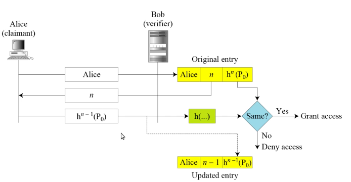

# Lamport OTP

## Introduction :

A **one-time password (OTP)** by definition is a type of password that could be used only once. The first use of such a password would grant access and any subsequent usage of the password would not. Such a mechanism is useful when passwords are being transmitted in the clear over a network in the presence of passive wiretappers who are monitoring communications. There are multiple ways to design a One-time password based authentication, They are as follows :

1. Where the user and the system agree upon a list of passwords each of which could be used only once .
   #### Drawbacks :
   - User and system has to keep a long list of passwords.
   - If passwords are not used in sequence , the system has to perform a long search to find a match.
2. Where the user and system agree to update the password sequentially using the agreed upon first password .
   #### Drawback :
   - The drawback of this approach is that if one was able to guess the first password then all the subsequent passwords will be known .
3. Where the user and system create a sequentially updated password using a hash function. This is better than the second approach as there is less chance to guess the password because of using a hash function.

The third approach which is devised by Leslie Lamport is known as **Lamport One Time Password**. One-time password was originally proposed to address the weaknesses of a simple password system. However, it has been widely used to design key management and authentication mechanisms.

## Working of Lamport One Time Password :

In this the user and the system agree upon an original password P0 and a counter n . The system calculates hn (P0) (hn means applying hash function n times).

    

As shown in Figure when the system receives the response of the user in the 3rd step it applies the hash function to see if the value received matches the value of the record in entry . If there is a match access is granted otherwise access is denied . The system then decrements the value of n in the entry and replaces the old password hn(P0) with new value hn-1(P0). When the user tries to access the system for the second time , the value of the counter it receives is n-1 and the third message from the user is now hn-2 (P0). And now the system applies the hash function to get hn-1(P0) which can then be compared to the updated entry .

## Implementation

There are two programs in this folder run them with the command `python server.py` followed by `python client.py`

- The client program prompts the user for username which will be sent to the server.
- The server which consists of the data of the different users searches for the username sent from the client and sends the respective id associated with the user to the client.
- The client program receives the number ‘n’
- Now the client program stores the number.
- Then the client program prompts the user to enter the password
- The entered password will be hashed n-1 times and will be sent to the server
- The server after receiving the hashed password hashes the password one more time and checks it with the hashed password stored in the db.
- If the password is correct as both the passwords (from the client,password present in the server program) are hashed same number of times they will match and the user will be logged in (A login successful message will be sent to the client) and the number and hashed password stored in the server will be updated with the new values n-1 and hashed password sent by the client.
- If the passwords don't match the user will not be logged in(A Login Failed message will be sent to the client)

## Drawback :

The value of n in the entry is decremented each time there is an access and when the value becomes 0 the user can no longer access the system and everything must be set up again.
For this reason the value of n is chosen a large number such as 1000.

## Bibiliography

1. Behrouz A. Forouzan. 2007. <i>Cryptography &amp; Network Security</i> (1st. ed.). McGraw-Hill, Inc., USA.

## Contributors

1. [Abhinav](https://github.com/kathuriabhinav)
2. [Karthik](https://github.com/iit2019191)
3. [Prasanth Kota](https://github.com/Evadore)